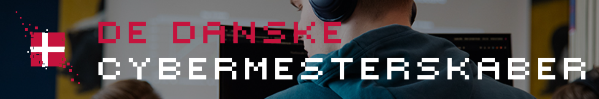
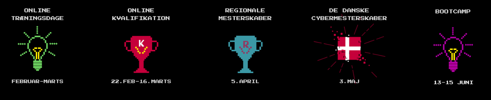
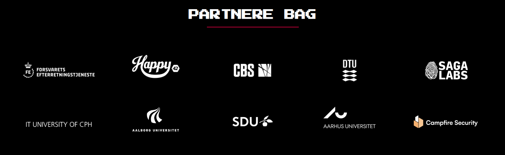

# ITU Cybersecurity Training for DDC: EXPLOITATION
Workshop on assembly, reverse eng, and binary exploitation for the Danish Cybersecurity Championships.
Held by Carsten Schürmann and Andrej Alfirević.
- February 21st and 22nd, 2025.
- March 7th and 8th, 2025.




# Contents

- [Credits](#credits)
- [Resource Links](#resource-links)
  - [Slides with Emulators](#slides-with-emulators)
  - [Emulators](#emulators)
  - [ASM Cheatsheet](#asm-cheatsheet)
  - [Exercises](#exercises)
  - [ASM Course](#asm-course)
  - [Online Decompiler](#online-decompiler)
  - [Online Compiler](#online-compiler)
  - [Kali Installation Guide](#kali-installation-guide)
- [Practice Resources](#practice-resources)
  - [RevEng and BinExploit](#reveng-and-binexploit)
  - [Other Challenges](#other-challenges)
- [ITUnderground](#itunderground)


### Credits:
Thanks to [Alessandro Bruni](https://github.com/hoheinzollern), and [Omu](https://omu.rce.so/) for the slides and emulators!

Last years [repo](https://github.com/hoheinzollern/workshop-cybersikkehed).



#### Resource links:

- [Slides with emulators](https://schuermann.org/)

- [Emulators](https://xladn0.rf.gd/itu/ddc/?i=1)

```python
In the off chance that the domains are down the "fixed" emulators are in this repo.
```

- [ASM cheatsheet](https://cs.brown.edu/courses/cs033/docs/guides/x64_cheatsheet.pdf)

- [Exercises](https://omu.rce.so/gcc-2022/)

As **extra** information and practice you can finish this cool and quick ASM chrash course!

- [ASM Course](https://omu.rce.so/lessons/asm-x86-64/)

Its short (about an hour to complete) and has little quizes. It might also help you recap today and/or warm you up for continuing tommorow!
(not mandatory!!!) 

- [Online Decompiler](https://dogbolt.org/)
- [Online Compiler](https://godbolt.org/)

Heres a simple walkthrough to help you install a kali (or any other distro) VM with virtual box.
- [Kali Docs](https://www.kali.org/docs/virtualization/install-virtualbox-guest-vm/)
- [Video tutorial](https://www.youtube.com/watch?v=wX75Z-4MEoM)


### Practice, practice, practice !!!

To really foster the knowledge you gained try playing around with challenges from these resources:

#### RevEng and BinExploit
- [CrackMes](https://crackmes.one/)
- [0 2 Hero](https://github.com/seal9055/PWN_Zero2Hero)

#### Above and more
- [PicoCTF](https://www.picoctf.org/)
- [TryHackMe](https://tryhackme.com/room/reverselfiles)


### ITUnderground


<br><br>
ITUnderground is ITU's own hacking club where we both compete in and host our own CTF's.
<br><br>

- [Website](https://itunderground.dk/)
- [Github](https://github.com/ITUnderground)
- [Discord](https://itunderground.dk/pages/discord)
